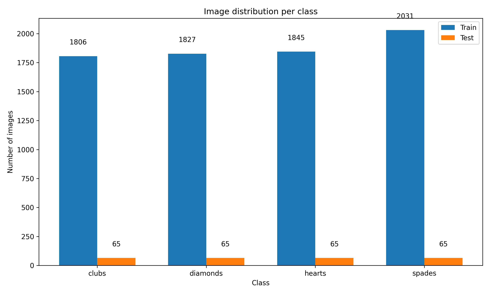

# Detector de palo de cartas de baraja francesa mediante CNN

Este proyecto implementa un clasificador multiclase de imágenes utilizando Redes Neuronales Convolucionales (CNN) para distinguir entre diferentes palos de cartas. El modelo utiliza la técnica de transfer learning a través de la arquitectura ResNet50 preentrenada para maximizar el rendimiento con menor tiempo de entrenamiento. El dataset utilizado es: [Cards Image Dataset-Classification](https://www.kaggle.com/datasets/gpiosenka/cards-image-datasetclassification) 

## Descripción del Proyecto
- Clasificación Automática de Cartas: El modelo clasifica imágenes de cartas en cuatro categorías: clubs, hearts, diamonds y spades.
- Aumento de Datos: Usamos técnicas de aumento de datos para mejorar la generalización del modelo, como reescalado de imágenes, rotación y volteo horizontal.

## Descripción del Dataset
El dataset utilizado en este proyecto es el "Cards Image Dataset-Classification". Contiene imágenes de las siguientes cuatro clases:

- Clubs (Trébol)
- Hearts (Corazón)
- Diamonds (Diamante)
- Spades (Picas)


## Estructura del Proyecto

El proyecto está organizado en dos archivos principales que conforman un flujo completo de machine learning y una aplicación web para probar el modelo resultante:

1. **main.ipynb**: Jupiter Notebook con toda la implementación con TensorFlow.
2. **app.py**: Aplicación de Flask para probar el modelo.

# Modelos
Se probaron tres diferentes modelos para llevar a cabo la experimentación de este proyecto:

## V1

Para la primera versión del proyecto, se experimentó utilizando 53 diferentes clases, una por cada carta de la baraja (incluyendo el joker).

**Arquitectura V1:**

El modelo es una red neuronal secuencial:

- **4 capas Conv2D** con función de activación ReLU.
- **4 capas MaxPooling2D** para reducción de dimensionalidad.
- **1 capa Flatten** para aplanar las características extraídas.
- **1 capa Dropout** con una tasa de 0.5 para evitar sobreajuste.
- **1 capa Densa** con 512 nodos y función de activación ReLU.
- **1 capa Densa (capa de salida)** con 4 nodos y función de activación Softmax.

### Entrenamiento del Modelo:
- **Optimización**: Optimizador Adam con una tasa de aprendizaje de 1e-4.
- **Función de Pérdida**: Categorical Crossentropy.
- **Métricas**: Precisión (Accuracy) para evaluar el rendimiento del modelo.


Las gráficas de precisión y pérdida durante el entrenamiento muestran la evolución del rendimiento del modelo a lo largo de las 30 epochs


La matriz de confusión resultante


Evaluación en el Conjunto de Validación:

- Precisión en el conjunto de validación: 54.93%
- Pérdida en el conjunto de validación: 1.5863

Podemos observar que la cantidad de datos para hacer el entrenamiento es muy poca. Existen alrededor de 8 mil imagenes de entrenamiento, pero dividido entre 53 clases signiificaba que habias solamente ~150 imágenes de entrenamiento, las cuales no eran suficientes para poder hacer un entrenamiento adecuado. Es por esto que se decidió cambiar el enfoque a solo 4 clases (los palos de las cartas).

## V2

- En V1, se observó que habían muy pocos datos de entrenamiento para las 53 clases que se esperaban clasificar. Por lo que decidí cambiar el número de clases a 4.




**Arquitectura V2:**

El modelo es una red neuronal secuencial con la técnica de transfer learning y fine tuning, basados en los papers [Improved Food Recognition ResNet50](https://www.sciencedirect.com/science/article/pii/S235291482200065X) [Transfer Learning ResNet50 COVID-19 Classification](https://www.sciencedirect.com/science/article/pii/S266592712500036X):

- **1 capa ResNet50** pre-entrenada.
- **4 capas BatchNormalization** con función de activación ReLU.
- **3 capas Dropout** con una tasa que se divide entre dos cada capa para evitar sobreajuste.
- **3 capas Densas** con 512, 256 y 128 nodos respectivamente y función de activación ReLU.
- **1 capa Densa (capa de salida)** con 4 nodos y función de activación Softmax.

### Entrenamiento del Modelo:
- **Optimización**: Optimizador Adam con una tasa de aprendizaje de 1e-4.
- **Función de Pérdida**: Categorical Crossentropy.
- **Métricas**: Accuracy, AUC, Precision, Recall.


Las gráficas de precisión y pérdida durante el entrenamiento muestran la evolución del rendimiento del modelo a lo largo de las 30 epochs


La matriz de confusión resultante


Evaluación en el Conjunto de Validación:

- Precisión en el conjunto de validación: 70.32%
- Pérdida en el conjunto de validación: .6950

Mejora mucho la presición comparada con la V1, se observa que tanto reducir la cantidad de categorias como usar la técnica de Transfer Learning ayuda, pero por alguna razón no tiene las métricas esperadas que se observanan en otros papers que hablaban de utilizar este modelo. Después de hablar con un experto, se identificó que el error estaba en la implementación del código, no del modelo.

En específico en estas líneas:

```
for layer in modelo_base.layers[:-15]:
        layer.trainable = False
```

## V3

- En V1, se observó que habían muy pocos datos de entrenamiento para las 53 clases que se esperaban clasificar. Por lo que decidí cambiar el número de clases a 4.


**Arquitectura V3:**

El modelo es una red neuronal secuencial con la técnica de transfer learning y fine tuning, basados en los papers [Improved Food Recognition ResNet50](https://www.sciencedirect.com/science/article/pii/S235291482200065X) [Transfer Learning ResNet50 COVID-19 Classification](https://www.sciencedirect.com/science/article/pii/S266592712500036X) Y muy parecido a la V2, pero con un ajuste en el número de capas y la manera de implementar el fine tuning.

- **1 capa ResNet50** pre-entrenada.
- **2 capas BatchNormalization** con función de activación ReLU.
- **2 capas Dropout** con una tasa que se divide entre dos cada capa para evitar sobreajuste.
- **2 capas Densas** con 512, 256 nodos respectivamente y función de activación ReLU.
- **1 capa Densa (capa de salida)** con 4 nodos y función de activación Softmax.

### Entrenamiento del Modelo:
- **Optimización**: Optimizador Adam con una tasa de aprendizaje de 1e-4.
- **Función de Pérdida**: Categorical Crossentropy.
- **Métricas**: Accuracy, AUC, Precision, Recall.


Las gráficas de precisión y pérdida durante el entrenamiento muestran la evolución del rendimiento del modelo a lo largo de las 30 epochs


La matriz de confusión resultante


Evaluación en el Conjunto de Validación:

- Precisión en el conjunto de validación: 100%
- Pérdida en el conjunto de validación: 0.0

La precisión y pérdida son perfectas en el set de validación, lo cual puede indicar overfitting, pero después de utilizar el set de prueba, igualmente da 100% de precicion. Por lo que puedo intuir que el modelo, si bien no puede ser 100 % en todos los casos, ejecuta su tarea muy cerca de la perfección. 

# Conclusiones

El proyecto de detección de palos de cartas usando CNNs muestra una clara evolución a través de tres versiones, con mejoras significativas en cada iteración:

La primera versión (V1) intentó clasificar las 53 cartas individuales de la baraja francesa, pero el rendimiento fue limitado (54.93% de precisión) debido a la insuficiente cantidad de datos por clase (~150 imágenes por carta).

La segunda versión (V2) redefinió el enfoque para clasificar únicamente los 4 palos (tréboles, corazones, diamantes y picas), implementando transfer learning con ResNet50 preentrenada. Esta mejora del diseño elevó la precisión al 70.32%, demostrando el valor de reducir la complejidad del problema y aprovechar modelos preentrenados.

La versión final (V3) optimizó la arquitectura y el proceso de fine-tuning, alcanzando una precisión del 100% tanto en el conjunto de validación como en el de prueba. Aunque este resultado perfecto podría sugerir sobreajuste, la consistencia en ambos conjuntos indica que el modelo es realmente efectivo para esta tarea específica.

Este proyecto demuestra claramente la importancia de:
1. Definir adecuadamente el alcance del problema según los datos disponibles
2. Aplicar técnicas de transfer learning para problemas con conjuntos de datos limitados
3. Optimizar la arquitectura y el proceso de entrenamiento de manera iterativa
4. Implementar técnicas de aumento de datos para mejorar la robustez del modelo

La implementación final logra una excelente capacidad para clasificar los palos de cartas y podría ser fácilmente integrada en aplicaciones prácticas a través de la interfaz web desarrollada en Flask.

# Ejecutar localmente

## Requisitos

- Python 3.8+
- TensorFlow 2.x
- NumPy
- Matplotlib

## Preparación del Entorno

1. Usar un entorno virtual:

```bash
python -m venv .venv
source .venv/bin/activate 
```

2. Instalar dependencias:

```bash
pip install tensorflow numpy matplotlib pillow
```

## Ejecución del Pipeline

Ejecutar todo el archivo main.ipynb

## Parámetros del Modelo

- **Arquitectura**: ResNet50 preentrenada en ImageNet (transfer learning)
- **Input**: Imágenes RGB de 224x224 píxeles
- **Optimizador**: Adam con learning rate adaptativo
- **Función de pérdida**: Cross-Entropy
- **Métricas**: Accuracy, AUC-ROC, Precision, Recall, F1-Score
- **Regularización**: Dropout (0.3), Early Stopping, Reducción de learning rate

## Técnicas de Data Augmentation

Para mejorar la robustez del modelo, se aplican las siguientes transformaciones:
- Rotación aleatoria (±15°)
- Desplazamiento horizontal y vertical (10%)
- Volteo horizontal
- Normalización de píxeles al rango [0,1]

## Resultados y Visualización

Los resultados del entrenamiento se guardan en el directorio `resultados`:
- Modelo con mejores pesos (`cnn_detector_*_best.keras`)
- Modelo final (`cnn_detector_*_final.h5`)
- Curvas de aprendizaje (accuracy y loss)
- Historial de entrenamiento (formato JSON)

## Autor

Santiago Rodriguez Murialdo

## Referencias

Md. Belal Hossain, S.M. Hasan Sazzad Iqbal, Md. Monirul Islam, Md. Nasim Akhtar, Iqbal H. Sarker. Transfer learning with fine-tuned deep CNN ResNet50 model for classifying COVID-19 from chest X-ray images, https://doi.org/10.1016/j.imu.2022.100916. (https://www.sciencedirect.com/science/article/pii/S235291482200065X)

Pouya Bohlol, Soleiman Hosseinpour, Mahmoud Soltani Firouz. Improved food recognition using a refined ResNet50 architecture with improved fully connected layers, https://doi.org/10.1016/j.crfs.2025.101005. (https://www.sciencedirect.com/science/article/pii/S266592712500036X)