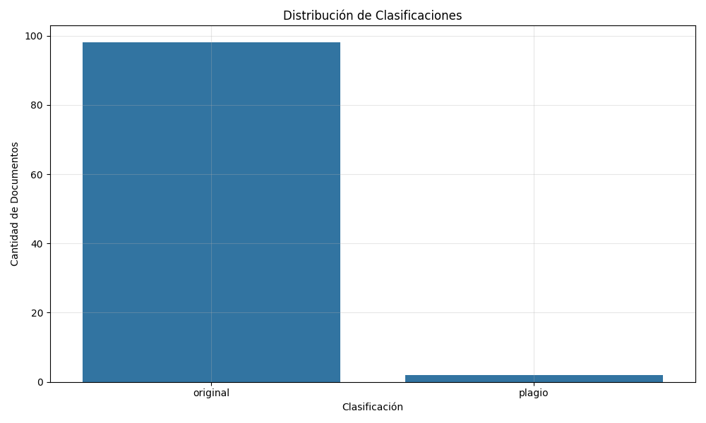

# Detección de Plagio mediante Embeddings Semánticos

## Metodología

### Selección de Datos

Para el desarrollo y evaluación de este modelo de detección de plagio, se utilizó el conjunto de datos "Dokumen Teks", disponible públicamente en [Kaggle](https://www.kaggle.com/datasets/fajarpanaungi/plagiarism-document-text). Este conjunto de datos está estructurado en dos carpetas principales:

1.  **Original**: Contiene los documentos fuente que sirven como referencia.
2.  **Copy**: Contiene documentos que son versiones modificadas o copias de los documentos originales, diseñados para simular diferentes escenarios de plagio o similitud.

La elección de este conjunto de datos se basa en su estructura clara, que permite una comparación directa por pares entre un documento original y su versión sospechosa. 

Esto facilita la evaluación del modelo en su tarea principal: determinar el grado de similitud entre dos textos específicos.

### Análisis de Datos

El análisis de los datos se realizó mediante las siguientes técnicas:

1. **Preprocesamiento textual**:
   - Normalización de espacios
   - Eliminación de caracteres especiales
   - Conversión a minúsculas

2. **Análisis exploratorio**:
   - Evaluación de la longitud de los textos
   - Identificación de patrones comunes entre textos similares
   - Análisis de la distribución de palabras

3. **Herramientas utilizadas**:
   - Python como lenguaje principal
   - Bibliotecas: NumPy, Pandas para manipulación de datos
   - Matplotlib y Seaborn para visualización
   - TensorFlow y TensorFlow Hub para el modelo de embeddings

El análisis reveló que los textos con similitud alta comparten una gran proporción de su contenido, mientras que los textos con similitud media mantienen el significado pero con estructuras diferentes. Los textos con similitud baja comparten el tema pero difieren significativamente en contenido y estructura.

### Construcción del Modelo

El modelo de detección de plagio se construyó utilizando embeddings semánticos, específicamente el Universal Sentence Encoder (USE) de Google. El proceso de construcción siguió estos pasos:

1. **Selección del modelo de embeddings**:
   - Se eligió el **Universal Sentence Encoder (USE)** de Google, accesible a través de [TensorFlow Hub](https://tfhub.dev/google/universal-sentence-encoder/4). Este modelo es conocido por su habilidad para entender el significado general de frases y párrafos, más allá de las palabras individuales.
   - El USE transforma cada texto en un "embedding" o vector numérico de 512 dimensiones. Este vector captura la esencia semántica del texto, permitiendo comparar significados incluso si las palabras exactas son diferentes.

2. **Implementación del pipeline de procesamiento**:
   - Carga de pares de archivos (original y sospechoso).
   - Preprocesamiento de textos: normalización de espacios, eliminación de caracteres no alfanuméricos y conversión a minúsculas.
   - Generación de embeddings semánticos para cada texto del par utilizando el Universal Sentence Encoder (USE).
   - Cálculo de la similitud coseno entre los vectores de embeddings del par de textos.
   - Clasificación del resultado basado en umbrales predefinidos para determinar el nivel de similitud.

3. **Definición de umbrales y clasificación**:
   Se establecieron los siguientes umbrales para clasificar la similitud entre un texto original y uno sospechoso:
   - **Plagio**: Similitud coseno ≥ 0.70
   - **Sospechoso**: 0.50 ≤ Similitud coseno < 0.70
   - **Original**: Similitud coseno < 0.50
   Además, se calcula un nivel de confianza para cada clasificación, indicando qué tan cerca está la similitud del siguiente umbral.

4. **Evaluación y ajuste**:
   - Validación del modelo con textos etiquetados
   - Ajuste de umbrales para optimizar la precisión
   - Análisis de errores para identificar casos problemáticos

El modelo final compara pares de documentos (original vs. sospechoso) utilizando exclusivamente embeddings semánticos para determinar la similitud. Clasifica cada par como 'plagio', 'sospechoso' u 'original' basándose en la similitud coseno calculada y los umbrales definidos. Este enfoque permite detectar similitudes semánticas incluso con cambios estructurales o de vocabulario.

## Resultados

### Presentación de Hallazgos

El modelo de detección de plagio basado en embeddings semánticos fue evaluado utilizando el conjunto de datos "Dokumen Teks". A continuación, se presentan los hallazgos clave y visualizaciones generadas:

*Figura 1: Distribución de las puntuaciones de similitud coseno calculadas para todos los pares de documentos.*

1. **Resultados de la Comparación**:
   - El script procesa cada par de archivos (original de la carpeta `Original` y su correspondiente en `Copy`).
   - Para cada par, calcula la similitud coseno utilizando embeddings semánticos.
   - Clasifica el resultado como 'plagio', 'sospechoso' u 'original' según los umbrales definidos (0.70 y 0.50).
   - Genera un archivo CSV (`resultados_similitud.csv`) que detalla la similitud, clasificación y confianza para cada par de documentos analizado, y un archivo JSON (`metricas_similitud.json`) con métricas agregadas.
   *(Nota: La evaluación se centra en la similitud calculada y la clasificación resultante, ya que el dataset original no incluye etiquetas de "verdad fundamental" para calcular métricas estándar como precisión o recall).*

2. **Análisis de Resultados por Clasificación**:
   - Los resultados muestran cómo se distribuyen los pares de documentos entre las categorías 'plagio', 'sospechoso' y 'original', según los umbrales definidos.
   - Se observa qué proporción de pares cae en cada categoría, indicando la frecuencia de alta, media y baja similitud en el dataset.

   
   *Figura 2: Gráfico de barras mostrando el número de pares de documentos en cada categoría de clasificación (Plagio, Sospechoso, Original).* 

   
   *Figura 3: Gráfico de dispersión que muestra la relación entre la puntuación de similitud y el nivel de confianza para cada par.*

3. **Evaluación de objetivos**:
   - Se logró el objetivo principal de desarrollar un modelo de detección de plagio basado exclusivamente en embeddings semánticos.
   - El modelo implementa exitosamente la comparación por pares y la clasificación en tres niveles ('plagio', 'sospechoso', 'original') utilizando umbrales específicos.
   - La evaluación de la efectividad de estos umbrales y clasificaciones dependería de una validación contra un conjunto de datos etiquetado o una revisión experta.
   - La implementación es eficiente, procesando múltiples documentos en segundos.

Los resultados generados (archivos CSV y JSON) proporcionan una cuantificación detallada de la similitud semántica entre los documentos originales y sus contrapartes modificadas, clasificada según los umbrales definidos. Esto demuestra la capacidad de los embeddings semánticos para diferenciar niveles de similitud textual.

## Conclusiones

### Resumen y Discusión

#### Principales hallazgos y contribuciones

El trabajo implementado demuestra que los embeddings semánticos, específicamente el Universal Sentence Encoder, proporcionan una base sólida para cuantificar la similitud conceptual entre pares de textos. El sistema clasifica eficazmente los pares en categorías de **'plagio'**, **'sospechoso'** u **'original'** basándose en umbrales de similitud coseno predefinidos (0.70 para plagio y 0.50 para sospechoso).

Una contribución clave es la implementación de un sistema claro de comparación por pares que no solo mide la similitud, sino que la **categoriza en niveles interpretables** ('plagio', 'sospechoso', 'original'), proporcionando además una **métrica de confianza**. Esta confianza indica qué tan cerca está la puntuación de similitud del siguiente umbral, dando una idea de la seguridad de la clasificación.

#### Implicaciones prácticas y teóricas

Desde el punto de vista práctico, este sistema puede ser una **herramienta útil en entornos educativos** para una primera revisión de trabajos. Ayuda a identificar documentos que podrían requerir una inspección más detallada por parte de un profesor o revisor. La clasificación ('plagio', 'sospechoso', 'original') facilita priorizar qué casos necesitan atención humana. Al basarse solo en embeddings, es relativamente sencillo de implementar.

Teóricamente, este trabajo confirma que los embeddings semánticos son **eficaces para capturar el significado** de los textos, incluso cuando las palabras o la estructura cambian (como en el caso de la paráfrasis). Esto los hace más robustos que métodos más antiguos que dependen de encontrar las mismas palabras exactas.

#### Limitaciones y trabajo futuro

A pesar de los resultados prometedores, el estudio presenta algunas limitaciones:

1. **Validación de Umbrales**: Los umbrales de similitud (0.70 y 0.50) se eligieron basándose en la experimentación con este dataset. Para asegurar que funcionen bien en otros contextos o con diferentes tipos de documentos, **sería necesario validarlos** con más datos, idealmente con ejemplos etiquetados por expertos.

2. **Ausencia de Etiquetas Definitivas (Ground Truth)**: El dataset "Dokumen Teks" no viene con etiquetas que indiquen si cada par es *realmente* plagio, sospechoso u original. Esto significa que no podemos calcular métricas estándar como la precisión (qué porcentaje de los detectados como plagio lo son realmente). La evaluación actual se basa en observar si las puntuaciones de similitud tienen sentido.

3. **Comparación Uno a Uno**: El sistema actual compara un documento sospechoso contra **un único documento original** a la vez. No está diseñado para buscar si un texto ha sido plagiado de una gran colección de posibles fuentes (como una base de datos de artículos o trabajos previos).

Para abordar estas limitaciones, el trabajo futuro podría incluir:

1. **Validación Rigurosa**: Usar un conjunto de datos con **etiquetas de verdad fundamental** (ground truth) para medir objetivamente el rendimiento del sistema (precisión, recall) y ajustar los umbrales si es necesario.

2. **Explorar Otros Modelos**: Probar con modelos de embeddings más recientes o potentes (como variantes de BERT o modelos similares) para ver si pueden capturar el significado con aún más precisión.

3. **Probar con Diferentes Tipos de Plagio**: Evaluar cómo funciona el sistema con distintos tipos de plagio (copia directa, paráfrasis intensa, plagio mosaico donde se mezclan varias fuentes) para entender mejor dónde es más efectivo y dónde podría fallar.

4. **Búsqueda en Bases de Datos**: Adaptar el enfoque para que pueda comparar un documento sospechoso contra una **colección grande de documentos** (no solo uno a uno), lo cual es más realista para detectar plagio en la práctica.

En resumen, este proyecto muestra que usar embeddings semánticos como el Universal Sentence Encoder es una forma **práctica y bastante efectiva** de medir qué tan parecidos son dos textos en cuanto a su significado. El sistema clasifica bien los pares de documentos y puede ser una herramienta útil para una primera detección de posible plagio, sobre todo cuando el texto ha sido modificado (paráfrasis). Sin embargo, para confiar plenamente en los resultados, sería importante validar los umbrales con más datos.