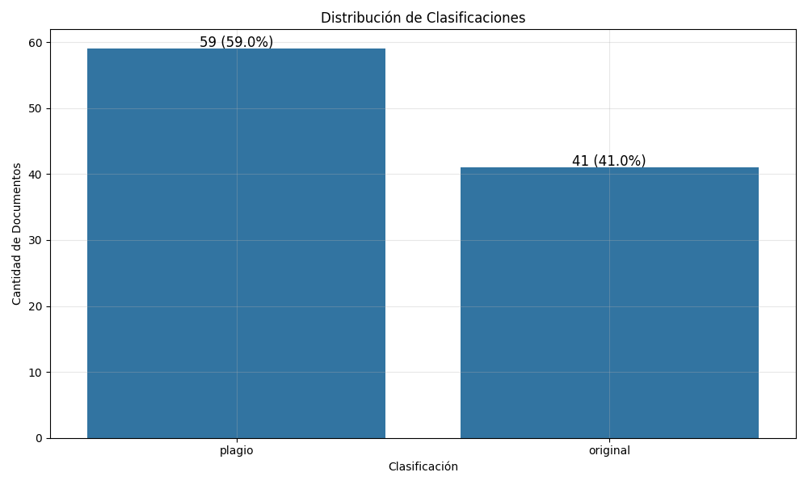
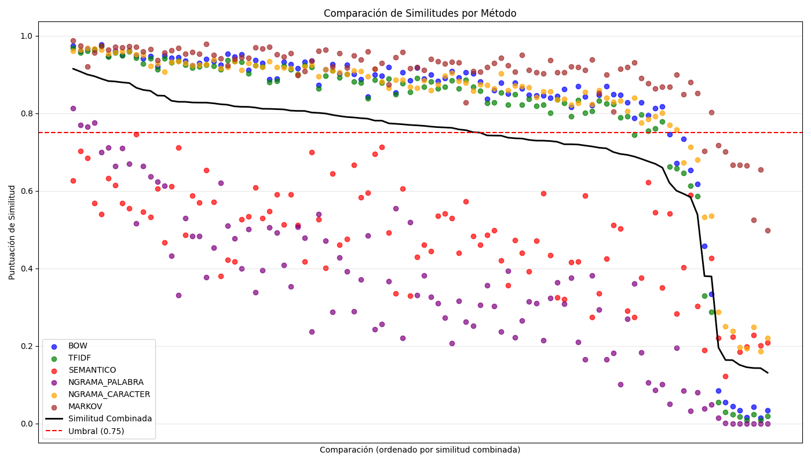
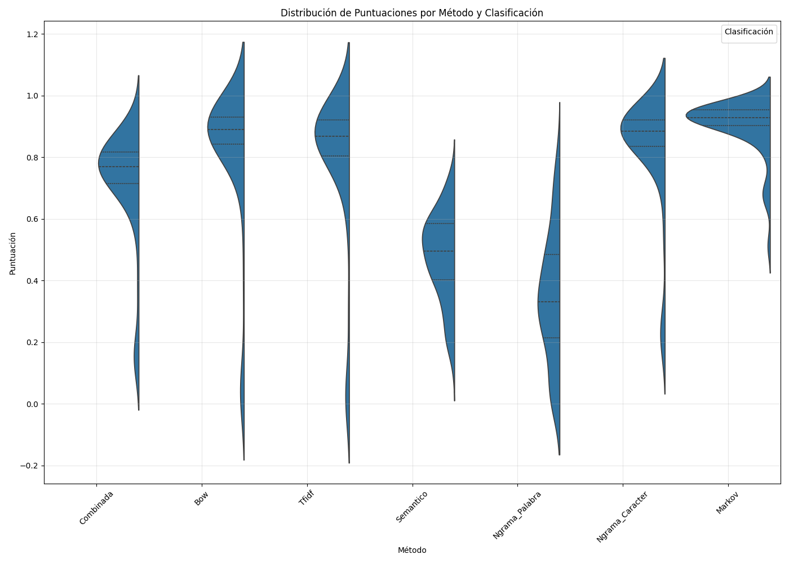
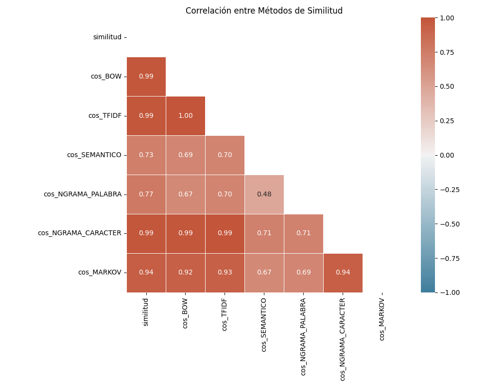
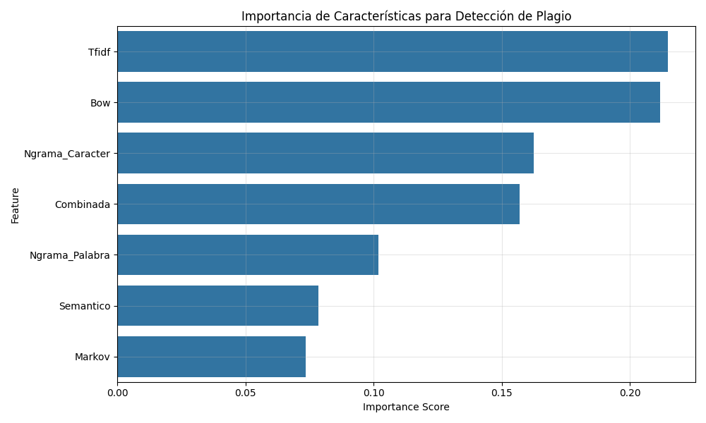

          
# Reporte: Sistema de Detección de Plagio

## Índice
1. [Introducción](#introducción)
2. [Arquitectura del Sistema](#arquitectura-del-sistema)
3. [Metodología](#metodología)
   - [Preprocesamiento de Texto](#preprocesamiento-de-texto)
   - [Métodos de Análisis de Similitud](#métodos-de-análisis-de-similitud)
   - [Clasificación de Plagio](#clasificación-de-plagio)
4. [Implementación](#implementación)
   - [Configuración](#configuración)
   - [Flujo de Trabajo](#flujo-de-trabajo)
5. [Resultados](#resultados)
   - [Estadísticas Generales](#estadísticas-generales)
   - [Distribución de Clasificaciones](#distribución-de-clasificaciones)
   - [Rendimiento por Método](#rendimiento-por-método)
   - [Análisis de Clustering](#análisis-de-clustering)
   - [Matriz de Confusión](#matriz-de-confusión)
   - [Importancia de Características](#importancia-de-características)
6. [Conclusiones](#conclusiones)

## Introducción

Este reporte presenta un análisis detallado del sistema de detección de plagio desarrollado para identificar similitudes entre documentos de texto. El sistema utiliza múltiples técnicas de procesamiento de lenguaje natural (NLP) y aprendizaje automático para determinar si un documento sospechoso constituye un plagio de un documento original.

El sistema fue diseñado para analizar un corpus de documentos de texto, comparando pares de documentos originales y sospechosos, y generando métricas de similitud que permiten clasificar cada caso como "plagio" u "original". La implementación combina diferentes enfoques de análisis de similitud textual, desde métodos léxicos simples hasta técnicas semánticas avanzadas basadas en embeddings.

## Arquitectura del Sistema

El sistema de detección de plagio está compuesto por los siguientes componentes principales:

1. **Módulo de Preprocesamiento**: Normaliza y limpia los textos para su análisis.
2. **Módulo de Análisis de Similitud**: Implementa seis métodos diferentes para calcular la similitud entre textos.
3. **Módulo de Clasificación**: Determina si un documento es plagio basado en un umbral de similitud.
4. **Módulo de Evaluación**: Analiza los resultados y genera métricas de rendimiento.
5. **Módulo de Visualización**: Crea gráficos para interpretar los resultados.

La arquitectura está diseñada para ser modular, permitiendo la incorporación de nuevos métodos de análisis o la modificación de los existentes sin afectar al resto del sistema.

## Metodología

### Preprocesamiento de Texto

El preprocesamiento de texto es fundamental para obtener resultados precisos. El sistema implementa las siguientes técnicas:

1. **Normalización de espacios**: Elimina espacios múltiples y normaliza el formato.
2. **Filtrado de caracteres**: Conserva solo caracteres alfanuméricos y espacios.
3. **Conversión a minúsculas**: Estandariza el texto para evitar diferencias por capitalización.
4. **Tokenización**: Divide el texto en unidades léxicas (tokens).
5. **Lematización**: Reduce las palabras a su forma base o lema utilizando NLTK.

Este proceso asegura que las comparaciones se realicen sobre el contenido semántico del texto, minimizando la influencia de variaciones superficiales.

### Métodos de Análisis de Similitud

El sistema implementa seis métodos complementarios para el análisis de similitud:

1. **Bag of Words (BOW)**: Representa los documentos como vectores de frecuencia de palabras y calcula la similitud del coseno entre ellos.
2. **TF-IDF**: Similar a BOW, pero pondera las palabras según su frecuencia en el documento y su rareza en el corpus.
3. **Análisis Semántico**: Utiliza embeddings de texto generados por un modelo de lenguaje pre-entrenado para capturar relaciones semánticas.
4. **N-gramas de Palabras**: Analiza secuencias de palabras contiguas (bigramas y trigramas) para detectar frases similares.
5. **N-gramas de Caracteres**: Examina secuencias de caracteres para identificar similitudes a nivel de subcadenas.
6. **Modelos de Markov**: Analiza las probabilidades de transición entre caracteres para detectar patrones de escritura similares.

Cada método captura diferentes aspectos de la similitud textual, desde coincidencias léxicas exactas hasta relaciones semánticas más abstractas.

### Clasificación de Plagio

La clasificación final se realiza mediante una combinación ponderada de los resultados de los seis métodos de similitud. El sistema utiliza un umbral configurable para determinar si un documento es plagio:

- Si la similitud combinada ≥ umbral → Clasificado como "plagio"
- Si la similitud combinada < umbral → Clasificado como "original"

Además, el sistema calcula un nivel de confianza para cada clasificación, que indica qué tan cerca o lejos está el resultado del umbral de decisión.

## Implementación

### Configuración

El sistema utiliza una configuración global que define:

```python
CONFIG = {
    # Configuración de análisis de similitud
    'similitud': {
        'umbral_plagio': 0.75,  # Umbral para plagio
    },
    # Pesos para diferentes métodos de similitud
    'pesos': {
        'bow': 0.15,
        'tfidf': 0.20,
        'semantico': 0.25,
        'ngrama_palabra': 0.15,
        'ngrama_caracter': 0.20,
        'markov': 0.05
    },
    # Rutas de carpetas
    'rutas': {
        'documentos_originales': './Dokumen Teks/Original',
        'documentos_sospechosos': './Dokumen Teks/Copy'
    }
}
```

Esta configuración permite ajustar fácilmente los parámetros del sistema, como el umbral de plagio y los pesos asignados a cada método de similitud.

### Flujo de Trabajo

El flujo de trabajo del sistema sigue estos pasos:

1. **Carga de documentos**: Lee los archivos de texto originales y sospechosos.
2. **Preprocesamiento**: Aplica las técnicas de limpieza y normalización a cada texto.
3. **Cálculo de similitudes**: Aplica los seis métodos de análisis y calcula la similitud combinada.
4. **Clasificación**: Determina si cada par de documentos constituye un caso de plagio.
5. **Evaluación**: Genera métricas de rendimiento y estadísticas.
6. **Visualización**: Crea gráficos para interpretar los resultados.

El sistema está diseñado para procesar grandes volúmenes de documentos de manera eficiente, con mecanismos de manejo de errores y optimizaciones para reducir el consumo de recursos.

## Resultados

### Estadísticas Generales

El análisis de 100 pares de documentos arrojó los siguientes resultados generales:

- **Similitud media**: 0.716
- **Similitud mediana**: 0.768
- **Similitud mínima**: 0.131
- **Similitud máxima**: 0.915
- **Desviación estándar**: 0.189

Estos valores indican una distribución amplia de similitudes, con una tendencia hacia valores altos (por encima del umbral de plagio).


### Distribución de Clasificaciones

De los 100 documentos analizados:
- **59 (59%)** fueron clasificados como plagio
- **41 (41%)** fueron clasificados como originales

Esta distribución sugiere una prevalencia significativa de plagio en el corpus analizado.



### Rendimiento por Método

El análisis de rendimiento de cada método de similitud muestra:

| Método | Media | Mediana | Mínimo | Máximo | Desv. Estándar |
|--------|-------|---------|--------|--------|----------------|
| BOW | 0.808 | 0.889 | 0.015 | 0.978 | 0.246 |
| TF-IDF | 0.787 | 0.869 | 0.008 | 0.973 | 0.251 |
| Semántico | 0.478 | 0.495 | 0.122 | 0.746 | 0.140 |
| N-gramas Palabra | 0.345 | 0.331 | 0.000 | 0.814 | 0.207 |
| N-gramas Carácter | 0.823 | 0.884 | 0.186 | 0.969 | 0.192 |
| Markov | 0.902 | 0.929 | 0.498 | 0.988 | 0.092 |

Observaciones destacables:
- El método de **Markov** muestra la mayor similitud media (0.902) y la menor variabilidad (desv. est. 0.092).
- El método **Semántico** presenta una variabilidad moderada (desv. est. 0.140) y valores más bajos que los métodos basados en coincidencias léxicas.
- Los **N-gramas de Palabra** muestran los valores más bajos (media 0.345), sugiriendo que este método es más estricto en su evaluación de similitud.







### Análisis de Clustering

El sistema aplicó técnicas de clustering para evaluar la separabilidad de las clases:

- **Coeficiente de Silueta**: 0.263
- **Cluster Purity**: 0.69
- **Information Gain**: 0.097


### Matriz de Confusión

La matriz de confusión del clustering K-means muestra:

| | Predicción: Original | Predicción: Plagio |
|---------------------|---------------------|-------------------|
| **Real: Original** | 10 (Verdaderos Negativos) | 31 (Falsos Positivos) |
| **Real: Plagio** | 0 (Falsos Negativos) | 59 (Verdaderos Positivos) |

Métricas derivadas:
- **Precisión**: 0.656
- **Recall**: 1.000
- **F1-Score**: 0.792


### Importancia de Características

El análisis de importancia de características muestra la contribución relativa de cada método a la separación de clases:

1. **TF-IDF**: 21.5%
2. **BOW**: 21.2%
3. **N-gramas Carácter**: 16.3%
4. **Similitud Combinada**: 15.7%
5. **N-gramas Palabra**: 10.2%
6. **Semántico**: 7.8%
7. **Markov**: 7.3%

Esto sugiere que los métodos basados en frecuencia de palabras (TF-IDF, BOW) son los más discriminativos para la detección de plagio.



## Conclusiones

El sistema de detección de plagio desarrollado demuestra un rendimiento sólido, con una alta capacidad para identificar casos de plagio (recall del 100%) y una precisión aceptable (65.6%). La combinación de múltiples métodos de análisis de similitud proporciona una evaluación robusta que captura diferentes aspectos del plagio textual.

Aspectos destacables:

1. **Enfoque multimodal**: La combinación de seis métodos diferentes proporciona una evaluación más completa que cualquier método individual.

2. **Alta sensibilidad**: El sistema no pierde casos de plagio (falsos negativos = 0), lo que es crucial en aplicaciones donde detectar todos los casos de plagio es prioritario.

3. **Separabilidad de clases**: Los valores moderados de métricas de clustering (Silueta, Cluster Purity, Information Gain) indican que las características extraídas permiten una discriminación razonable entre documentos originales y plagios.

4. **Importancia de métodos léxicos**: Los métodos basados en frecuencia de palabras (TF-IDF, BOW) emergen como los más discriminativos, destacando la importancia de las coincidencias léxicas en la detección de plagio.

Áreas de mejora potencial:

1. **Reducción de falsos positivos**: El sistema tiende a clasificar algunos documentos originales como plagio, lo que podría mejorarse ajustando el umbral o los pesos de los métodos.

2. **Optimización de métodos semánticos**: El método semántico muestra un rendimiento moderado y podría beneficiarse de modelos de embeddings más avanzados.

3. **Exploración de modelos de lenguaje más avanzados**: La implementación actual podría reemplazarse por modelos más sofisticados como BERT o GPT para mejorar el análisis semántico.

En resumen, el sistema desarrollado proporciona una solución efectiva para la detección de plagio textual, combinando técnicas tradicionales y modernas de procesamiento de lenguaje natural para lograr un alto rendimiento en la identificación de similitudes textuales significativas.